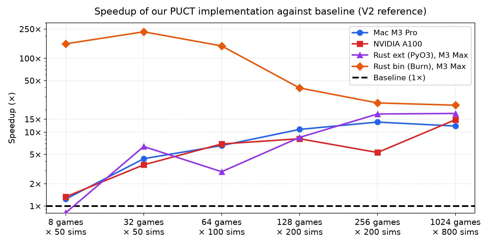

Blazing fast MCTS on CPU: 100,000s sims per second! :rocket: 

<p align="center">
  
</p>

This repository provides the benchmark for [gumbel-mcts](https://github.com/olivkoch/gumbel-mcts). 

We use a separate repository to keep the original repo minimal and due to a dependency on an external reference.

This benchmark demonstrates the following:

1. Our PUCT implementation strictly matches the output/policy of a golden standard [mcts_v2.py](https://github.com/michaelnny/alpha_zero/blob/main/alpha_zero/core/mcts_v2.py)
2. Our PUCT implementation is **2-15X faster** than this golden standard, both on Mac and NVIDIA GPUs
3. Gumbel is **much more simulation-efficient** than PUCT at similar throughput

All benchmarks use Gomoku (15×15, 225 actions). Run them from the `benchmarks/` directory using `uv` (e.g. `uv run python benchmarks/benchmark_puct_speedup.py`)

### PUCT Efficiency (`benchmark_puct_speedup.py`)

Measures the speedup of our PUCT implementation (V3 = `puct.py`) compared to V2 = `reference.py` taken from [mcts_v2.py](https://github.com/michaelnny/alpha_zero/blob/main/alpha_zero/core/mcts_v2.py)

The `n_parallel` parameter is used by the reference only. We pick the value that is most favorable to the reference for each games x sims configuration.

On a Mac M3 Pro:

| Config                                   | V2 (s)     | V3 (s)     | V3 sims/s    | Speedup     |
| -----------------------------------------|------------|------------|--------------|------------ |
| 8 games × 50 sims × 32 parallel          | 0.048      | 0.039      | 10254        | 1.24 x |
| 32 games × 50 sims × 32 parallel         | 0.209      | 0.048      | 33397        | 4.37 x |
| 64 games × 100 sims × 64 parallel        | 0.511      | 0.078      | 82449        | 6.58 x |
| 128 games × 200 sims × 16 parallel       | 2.210      | 0.203      | 126362       | 10.9 x |
| 256 games × 200 sims × 32 parallel       | 3.742      | 0.272      | 188123       | 13.7 x |
| 1024 games × 800 sims × 64 parallel      | 47.262     | 3.907      | 209676       | 12.1 x |

On an NVIDIA A100:

| Config                                   | V2 (s)     | V3 (s)     | V3 sims/s    | Speedup     |
| -----------------------------------------|------------|------------|--------------|------------ |
| 8 games × 50 sims × 16 parallel          | 0.079      | 0.059      | 6741         | 1.33 x |
| 32 games × 50 sims × 8 parallel          | 0.541      | 0.150      | 10667        | 3.61 x |
| 64 games × 100 sims × 64 parallel        | 0.974      | 0.141      | 45488        | 6.92 x |
| 128 games × 200 sims × 16 parallel       | 3.478      | 0.427      | 59945        | 8.15 x |
| 256 games × 200 sims × 32 parallel       | 6.967      | 1.314      | 38961        | 5.30 x |
| 1024 games × 800 sims × 64 parallel      | 94.432     | 6.400      | 128002       | 14.76 x |


### Throughput (`benchmark_throughput.py`)

Measures wall-clock time per MCTS search call at increasing scale.

| Variant | 50 sims / 500 nodes | 200 sims / 5K nodes | 800 sims / 50K nodes |
|---|---|---|---|
| **PUCT** | 2.70 ms | 11.0 ms | 52.5 ms |
| **GumbelDense** | 2.91 ms | 13.9 ms | 72.8 ms |
| **GumbelSparse** | 3.40 ms | 16.4 ms | 89.0 ms |

PUCT is fastest because it skips sequential halving. GumbelSparse is slower than GumbelDense due to indirection overhead, but the relationship reverses for larger action spaces (e.g. chess, 4672 actions) where sparse storage avoids iterating over thousands of illegal moves.

### Win rate (`benchmark_winrate.py`)

PUCT vs GumbelSparse head-to-head, 30 games, 50 sims/move, alternating colors.

| Model | PUCT wins | Gumbel wins |
|---|---|---|
| **Random** (uniform policy) | **100%** | 0% |
| **Heuristic** (simulates trained network) | 0% | **100%** |

With an uninformative policy, PUCT's broader UCB exploration wins. With an informative policy, Gumbel's sequential halving exploits the logits and dominates.

### Simulation efficiency (`benchmark_sparse_gumbel_efficiency.py`)

Gumbel fixed at 8 sims — how many PUCT sims to match? (we proxy a trained model with a noisy heuristic one)

| PUCT sims | PUCT win% |
|---|---|
| 8 | 45% |
| 16 | 35% |
| 32 | 38% |
| 64 | 43% |
| 128 | 43% |
| 256 | **55%** |

PUCT needs roughly **200× the simulation budget** to match Gumbel when the policy prior is informative.

## Python package (`gumbel_mcts_rs`)

`rust-python/` builds the Rust engines into a Python package with [maturin](https://github.com/PyO3/maturin):

```bash
cd rust-python
maturin develop --release
```

The classes are drop-in replacements for the Python engines. The model stays in Python: the search calls `model.forward_for_mcts` for each batch of leaf evaluations.

```python
import gumbel_mcts_rs as gmrs
tree = gmrs.PUCT(n_games, max_nodes, logic, device="cpu")  # or GumbelDense, GumbelSparse
tree.initialize_roots(active_games, boards, players)
tree.run_simulation_batch(model, active_games, num_simulations=50)
```

The benchmarks use the package when it is installed:

- `benchmark_throughput.py`: `-Rs` rows
- `benchmark_puct_speedup.py`: `V3rs` columns
- `benchmark_winrate.py`, `benchmark_sparse_gumbel_efficiency.py`: `--rust` flag
- `tests/test_rs_bindings.py`: binding tests

### Throughput — extension vs Python engines (M3 Max)

`Rust ext` runs the Rust search; the model is called back into Python. It is 1.5-2x faster than the numba engines. The pure-Rust binaries (next section) are faster again.

| Variant | 50 sims Py | 50 sims Rs (×) | 200 sims Py | 200 sims Rs (×) | 800 sims Py | 800 sims Rs (×) |
|---|---:|---:|---:|---:|---:|---:|
| PUCT | 4.18 ms | 2.56 ms (1.6×) | 19.2 ms | 9.71 ms (2.0×) | 53.6 ms | 37.8 ms (1.4×) |
| GumbelDense | 3.58 ms | 2.68 ms (1.3×) | 17.2 ms | 10.6 ms (1.6×) | 73.0 ms | 49.2 ms (1.5×) |
| GumbelSparse | 4.34 ms | 3.28 ms (1.3×) | 17.2 ms | 11.2 ms (1.5×) | 73.5 ms | 53.1 ms (1.4×) |

### PUCT efficiency — V3rs vs V3 (M3 Max, MPS)

V3 = numba + PyTorch. V3rs = Rust extension. Same model and eval callback for both. The callback cost dominates at small batches; V3rs wins from ~128 games up. The 1024-game rows are within noise (5-16s spread for identical work).

| Config | V3 (s) | V3rs (s) (×) | V3 sims/s | V3rs sims/s |
|---|---:|---:|---:|---:|
| 8 games × 50 sims × 32 parallel | 0.348 | 0.389 (0.9×) | 1150 | 1028 |
| 32 games × 50 sims × 32 parallel | 0.248 | 0.251 (1.0×) | 6445 | 6387 |
| 64 games × 100 sims × 64 parallel | 0.697 | 1.269 (0.5×) | 9178 | 5044 |
| 128 games × 200 sims × 16 parallel | 0.509 | 0.462 (1.1×) | 50322 | 55451 |
| 256 games × 200 sims × 128 parallel | 0.310 | 0.270 (1.1×) | 165057 | 189520 |
| 1024 games × 800 sims × 64 parallel | 15.762 | 13.356 (1.2×) | 51973 | 61333 |
| 1024 games × 800 sims × 512 parallel | 4.919 | 6.739 (0.7×) | 166533 | 121553 |
| 1024 games × 800 sims × 1024 parallel | 12.124 | 10.551 (1.1×) | 67568 | 77641 |

## Rust port (Burn)

`rust/` contains a pure-Rust port of all three search engines (PUCT, GumbelDense, GumbelSparse), the V2 reference (`parallel_uct_search`), and the benchmark models, using [Burn](https://github.com/tracel-ai/burn) (NdArray backend) for the neural network:

```bash
cd rust
cargo run --release --bin bench_throughput
cargo run --release --bin bench_puct_speedup
cargo run --release --bin bench_winrate
cargo run --release --bin bench_efficiency
cargo test --release   # sanity tests
```

All Rust numbers below were measured on an Apple M3 Max.

### PUCT Efficiency — Rust

V2 is the Rust port of the same reference algorithm (`reference.rs`), V3 is the Rust port of `puct.py`. Single-threaded tree traversal, Burn/NdArray for evaluation.

| Config                                   | V2 (s)     | V3 (s)     | V3 sims/s    | Speedup     |
| -----------------------------------------|------------|------------|--------------|------------ |
| 8 games × 50 sims × 32 parallel          | 0.004      | 0.002      | 172799       | 1.55 x |
| 32 games × 50 sims × 32 parallel         | 0.015      | 0.007      | 240237       | 2.26 x |
| 64 games × 100 sims × 64 parallel        | 0.054      | 0.025      | 255002       | 2.17 x |
| 128 games × 200 sims × 16 parallel       | 0.155      | 0.098      | 261921       | 1.59 x |
| 256 games × 200 sims × 32 parallel       | 0.306      | 0.191      | 268166       | 1.60 x |
| 1024 games × 800 sims × 64 parallel      | 4.377      | 5.213      | 157147       | 0.84 x |
| 1024 games × 800 sims × 512 parallel     | 9.695      | 5.749      | 142506       | 1.69 x |
| 1024 games × 800 sims × 1024 parallel    | 15.074     | 5.017      | 163281       | 3.00 x |

V3 sustains ~150-270K sims/s. The Rust V2 is ~10x faster than Python V2, which compresses the speedup ratio. At large scale, V3 time is dominated by the dense (max_nodes × 225) allocation.

### Throughput — Rust vs Python (M3 Max)

Python = numba kernels + PyTorch CPU, measured on the same machine. Rust = Burn NdArray backend. (Gumbel times vary run-to-run with the sampled root noise; values shown are a representative run.)

| Variant | 50 sims Py | 50 sims Rs (×) | 200 sims Py | 200 sims Rs (×) | 800 sims Py | 800 sims Rs (×) |
|---|---:|---:|---:|---:|---:|---:|
| PUCT | 2.77 ms | 1.65 ms (1.7×) | 10.9 ms | 6.75 ms (1.6×) | 45.6 ms | 32.7 ms (1.4×) |
| GumbelDense | 3.14 ms | 1.72 ms (1.8×) | 18.6 ms | 7.30 ms (2.5×) | 125.7 ms | 49.9 ms (2.5×) |
| GumbelSparse | 3.54 ms | 1.77 ms (2.0×) | 17.8 ms | 8.15 ms (2.2×) | 110.3 ms | 57.6 ms (1.9×) |

### Win rate — Rust

PUCT vs GumbelSparse head-to-head, 30 games, 50 sims/move, alternating colors — same result as Python:

| Model | PUCT wins | Gumbel wins |
|---|---|---|
| **Random** (uniform policy) | **100%** | 0% |
| **Heuristic** (simulates trained network) | 7% | **93%** |

### Simulation efficiency — Rust

Gumbel fixed at 8 sims — how many PUCT sims to match?

| PUCT sims | PUCT win% |
|---|---|
| 8 | 42% |
| 16 | 42% |
| 32 | 50% |
| 64 | 33% |
| 128 | 47% |
| 256 | 50% |
| 512 | **55%** |

## Conclusions

| Benchmark | Takeaway |
|---|---|
| `benchmark_puct_speedup` | V3 (our PUCT) is 1.2-15× faster than the V2 reference, with matching output. Confirmed on M3 Pro, M3 Max, and A100. |
| `benchmark_throughput` | Each engine finishes a search in single-digit to tens of ms on CPU. |
| `benchmark_winrate` | PUCT wins with a uniform policy prior (100%). Gumbel wins with an informative prior (93-100%). |
| `benchmark_sparse_gumbel_efficiency` | With an informative prior, PUCT needs ~256-512 sims to match Gumbel at 8 (~30-60× the budget). |
| Rust port + `gumbel_mcts_rs` | Same API and same results in Rust — ~1.5-2× faster per search, usable from Python through the extension or natively via the binaries. |

### Validation of PUCT against reference

To compare the output of `puct.py` against the golden reference: `uv run python tests/test_puct.py gomoku`